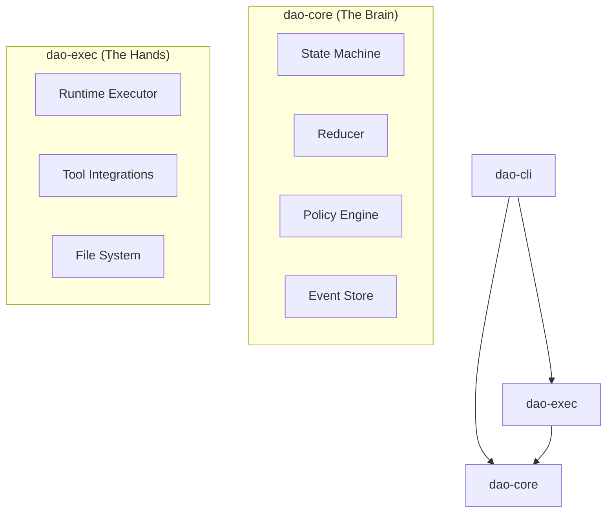

# DAO

<p align="center">
  
</p>

[](https://github.com/ShaileshRawat1403/dao/actions/workflows/ci.yml)
[](https://github.com/ShaileshRawat1403/dao/actions/workflows/release.yml)
[](https://opensource.org/licenses/MIT)

**DAO** is a workflow orchestrator, shipped as a standalone CLI, backed by an embeddable orchestration engine.

It acts as an orchestrator that:

- **Coordinates multiple steps**
- **Manages state across time**
- **Enforces ordering**
- **Handles interruptions and resumes safely**
- **Governs execution**

It orchestrates the lifecycle **Scan** → **Plan** → **Diff** → **Verify**, enforcing policy gates, pausing for approval, persisting state, and replaying deterministically.

## Features

| Feature                    | Description                                                                           |
| :------------------------- | :------------------------------------------------------------------------------------ |
| **Safety First**           | Built-in approval gates for execution and destructive actions. You decide what runs.  |
| **Deterministic Workflow** | Follows a structured lifecycle: `Scan` → `Plan` → `Diff` → `Verify`.                  |
| **Event Sourced**          | Every action is recorded in an append-only log. Pause, resume, or replay any session. |
| **Personality Modes**      | Configurable output styles: **Friendly** (verbose) or **Pragmatic** (terse).          |
| **Cross-Platform**         | Native binaries for macOS (Intel/Apple Silicon), Linux, and Windows.                  |

## Philosophy

DAO operates on the **I7 Loop**—a disciplined thinking and execution cycle designed to prevent drift and unsafe automation.

### DAO Alignment Summary

| I7 Stage        | DAO Layer         |
| :-------------- | :---------------- |
| **Ideate**      | CLI / Intent      |
| **Investigate** | State + Policy    |
| **Iterate**     | Reducers          |
| **Integrate**   | Core + Exec       |
| **Instrument**  | Events / Logs     |
| **Inspect**     | Replay / Review   |
| **Improve**     | Policy + Defaults |

Read the full I7 Loop documentation.

## Architecture

DAO is architected as a Rust workspace with a clean separation of concerns.



### Component Breakdown

| Crate          | Role         | Description                                                                                               |
| :------------- | :----------- | :-------------------------------------------------------------------------------------------------------- |
| **`dao-core`** | Domain Logic | Contains the state machine, reducer, policy simulation, and event sourcing logic. Pure and deterministic. |
| **`dao-exec`** | Runtime      | Handles side effects, tool execution, file system interactions, and git operations.                       |
| **`dao-cli`**  | Interface    | The user-facing command-line interface that bridges the user, core, and executor.                         |

## Installation

### Automated Install

**macOS / Linux**

```sh
curl --proto '=https' --tlsv1.2 -LsSf https://github.com/ShaileshRawat1403/dao/releases/latest/download/dao-installer.sh | sh
```

### Windows (PowerShell)

```powershell
irm https://github.com/ShaileshRawat1403/dao/releases/latest/download/dao-installer.ps1 | iex
```

### Manual Install

1. Download the archive for your platform from GitHub Releases.
2. Extract the archive.
3. Verify the checksum using the provided `.sha256` file.
4. Move the `dao` binary to your PATH.

```bash
dao --help
```

## Usage

### Running a Workflow

To start DAO on a repository, simply point it to the directory. It will scan the project and guide you through the workflow.

```bash
dao run --repo ./my-project
```

### TUI Cockpit

```bash
dao ui --repo .
```

Select backend explicitly if needed:

```bash
dao ui --repo . --provider ollama
dao ui --repo . --provider codex --model gpt-5
dao ui --repo . --provider gemini --model gemini-2.5-pro
```

In chat mode:
- `i` focuses chat input
- `/models` opens model picker
- `/model <name>` sets model directly
- `/provider <ollama|codex|gemini>` sets provider
- `/status` prints current runtime status
- `/tab <name|1-9>` jumps to a tab
- `/theme <name>` switches theme
- `/telemetry` opens telemetry tab
- `/clear` clears chat/system log buffer
- `/help` prints in-chat command help
- `Up/Down`, `PgUp/PgDn`, `End` scroll chat output
- Typing `/...` shows inline command suggestions

Telemetry:
- Press `t` for the live telemetry view (CPU, RAM, process memory, token rate).
- GPU metrics show live values when supported; otherwise explicit `N/A (unsupported)`.

Navigation:
- `1..9` jump directly to tabs in current tab order
- `z` toggle focus mode
- `+` / `-` or `Ctrl+Up/Down` resize chat input

### One-shot or Interactive Chat

```bash
dao chat "Explain this diff in plain language"
dao chat
dao chat --provider codex --model gpt-5 "Summarize this repository"
dao chat --provider gemini --model gemini-2.5-pro "Generate release notes from this diff"
```

Auth setup:
- Codex CLI: run `codex login` (supports ChatGPT login / API key).
- Gemini CLI: run `gemini` once in interactive terminal to complete OAuth.

## Supported Platforms

- macOS (Intel & Apple Silicon)
- Linux (x64)
- Windows (x64)

## Roadmap

See [ROADMAP.md](ROADMAP.md) for the plan to evolve DAO from a framework into a fully capable AI agent.
