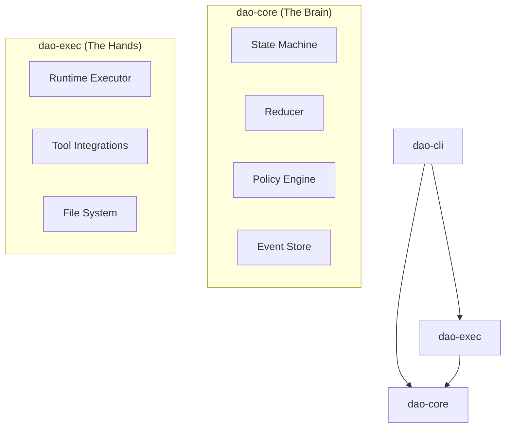

# DAO

<p align="center">
  
</p>

[](https://github.com/ShaileshRawat1403/dao/actions/workflows/ci.yml)
[](https://github.com/ShaileshRawat1403/dao/actions/workflows/release.yml)
[](https://opensource.org/licenses/MIT)

**DAO** is a deterministic, safety-first autonomous agent designed to help developers understand, plan, and execute software engineering tasks.

Unlike "black box" AI agents, DAO follows a strict, observable state machine loop (**Scan** → **Plan** → **Diff** → **Verify**), ensuring you always remain in control of the execution flow. It separates core policy logic from execution side effects, allowing for safe simulation and replayability.

## Features

| Feature                    | Description                                                                           |
| :------------------------- | :------------------------------------------------------------------------------------ |
| **Safety First**           | Built-in approval gates for execution and destructive actions. You decide what runs.  |
| **Deterministic Workflow** | Follows a structured lifecycle: `Scan` → `Plan` → `Diff` → `Verify`.                  |
| **Event Sourced**          | Every action is recorded in an append-only log. Pause, resume, or replay any session. |
| **Personality Modes**      | Configurable output styles: **Friendly** (verbose) or **Pragmatic** (terse).          |
| **Cross-Platform**         | Native binaries for macOS (Intel/Apple Silicon), Linux, and Windows.                  |

## Architecture

DAO is architected as a Rust workspace with a clean separation of concerns.



### Component Breakdown

| Crate          | Role         | Description                                                                                               |
| :------------- | :----------- | :-------------------------------------------------------------------------------------------------------- |
| **`dao-core`** | Domain Logic | Contains the state machine, reducer, policy simulation, and event sourcing logic. Pure and deterministic. |
| **`dao-exec`** | Runtime      | Handles side effects, tool execution, file system interactions, and git operations.                       |
| **`dao-cli`**  | Interface    | The user-facing command-line interface that bridges the user, core, and executor.                         |

## Installation

### Automated Install

**macOS / Linux**

```sh
curl --proto '=https' --tlsv1.2 -LsSf https://github.com/ShaileshRawat1403/dao/releases/latest/download/dao-installer.sh | sh
```

### Windows (PowerShell)

```powershell
irm https://github.com/ShaileshRawat1403/dao/releases/latest/download/dao-installer.ps1 | iex
```

### Manual Install

1. Download the archive for your platform from GitHub Releases.
2. Extract the archive.
3. Verify the checksum using the provided `.sha256` file.
4. Move the `dao` binary to your PATH.

```bash
dao --help
```

## Usage

### Running a Workflow

To start DAO on a repository, simply point it to the directory. It will scan the project and guide you through the workflow.

```bash
dao run --repo ./my-project
```

## Supported Platforms

- macOS (Intel & Apple Silicon)
- Linux (x64)
- Windows (x64)
